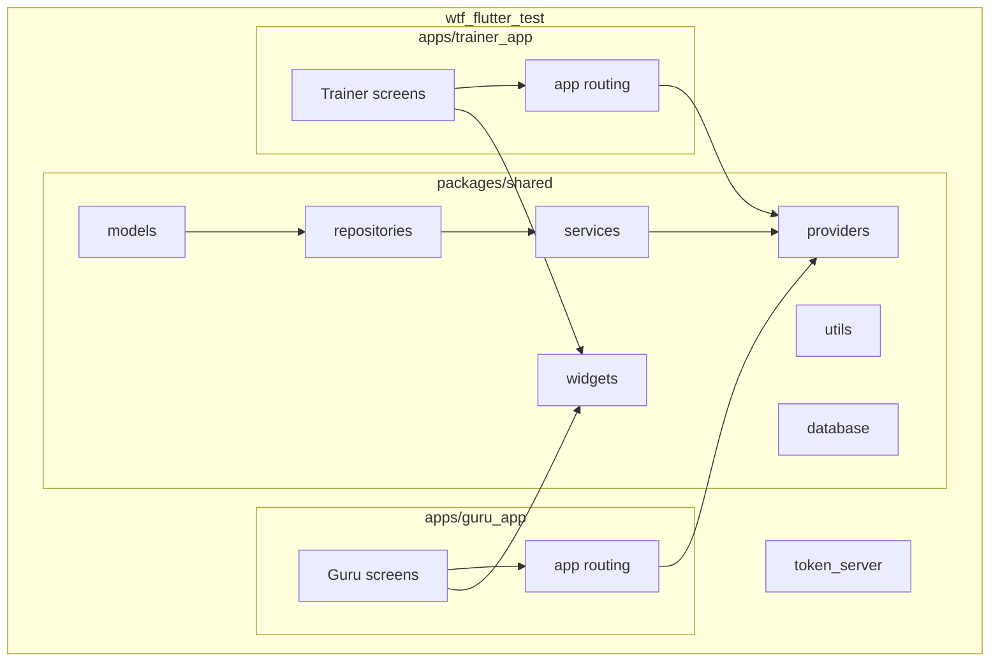

# System Architecture

## Overview & Diagram

## Layered Architecture

Views live in each app and in shared widgets. They call Riverpod providers, providers call services, services coordinate repositories, and repositories own Firestore or Drift access. Models stay immutable and JSON serializable.

Dependency rule: `Views -> Providers -> Services -> Repositories -> Models/Storage`.

## Data Flow

Firestore is the cross-app source of truth for users, messages, call requests, room metadata, and session logs. Drift provides local cache tables for users, messages, requests, room metadata, and logs. Firestore streams drive UI updates and can be mirrored to Drift for offline-first reads.

## Cross-App Communication

Guru and Trainer are separate mobile apps, so OS sandboxing prevents a shared local database. Firestore gives both apps a shared real-time channel with `snapshots()` streams. This avoids polling and keeps chat statuses, schedule changes, and session logs visible in both apps.

## 100ms Integration Flow

Trainer approval calls `token_server/POST /create-room`. Room metadata is saved to Firestore. Around the join window, each app uses its role room code with `HMSSDK.getAuthTokenByRoomCode`, then joins with `HMSConfig`. `CallService` implements all `HMSUpdateListener` callbacks and passes peer, track, error, and reconnect events into Riverpod call state.

## State Management

Riverpod providers live in `packages/shared/lib/providers`. Generated providers wrap auth, chat, schedule, sessions, and call state. App screens consume provider state and route through `go_router`.

## Error Handling Strategy

Async UI uses `AsyncValue.when` with loading, empty, and error states. Mutations show snackbars for validation, request status, and failure feedback. The token-server room creation has a local fallback so trainer approval can still be demonstrated without a running 100ms server.

## Logging & Observability

`WtfLogger` keeps recent tagged logs for `AUTH`, `CHAT`, `SCHEDULE`, and `RTC`. `DevPanel` exposes environment notes, recent logs, and state notes during debug builds.
